<div align="center">

[](LICENSE)
[](https://nodejs.org/)
[](https://docs.anthropic.com/en/docs/claude-code)
[](https://sethgammon.github.io/Citadel/)

*Autonomous engineering needs better infrastructure, not just better reasoning.*

</div>

## Quickstart

**Prerequisites:** [Claude Code](https://docs.anthropic.com/en/docs/claude-code) + [Node.js 18+](https://nodejs.org/)

Citadel is a Claude Code **plugin** — install once, works across all your projects. No per-project file copying.

```bash
# 1. Clone Citadel
git clone https://github.com/SethGammon/Citadel.git

# 2. Launch Claude Code with the plugin loaded
claude --plugin-dir /path/to/Citadel

# 3. Install hooks into your project (one-time per project)
node /path/to/Citadel/scripts/install-hooks.js

# 4. Run setup
/do setup

# 5. Try something
/do review src/main.ts
```

For persistent plugin install across all sessions, use the marketplace method inside Claude Code:
```
/plugin marketplace add /path/to/Citadel
/plugin install citadel@citadel-local
/reload-plugins
```

> **Note:** The hook installer (step 3) is required until [a known upstream bug](https://github.com/anthropics/claude-code/issues/24529) is resolved. It writes Citadel's hook config into your project's `.claude/settings.json` with resolved paths. `/do setup` will also run this automatically.

[Full install guide →](QUICKSTART.md)

## Try These First

```
/do fix the typo on line 42        # Direct edit, zero overhead
/do review the auth module         # 5-pass structured code review
/do why is the API returning 500   # Root cause analysis
/do build a caching layer          # Multi-step orchestrated build
```

Say what you want. `/do` routes it to the cheapest tool that can handle it.

## How It Works

You type what you want. `/do` classifies your intent across four tiers — pattern match, active session state, keyword lookup, and LLM classification — and dispatches to the cheapest tool capable of handling it. A typo fix never touches an LLM. A multi-service overhaul gets a parallel fleet with isolated worktrees and discovery sharing between waves.

Simple tasks get simple tools. Complex tasks get campaigns with phases, verification, and self-correction. You never have to choose.

**[▶ See it route live →](https://sethgammon.github.io/Citadel/)**

## The Orchestration Ladder

Four tiers. Use the cheapest one that fits.

<table>
<tr>
<td width="50%" align="center">

</td>
<td width="50%" align="center">

</td>
</tr>
<tr>
<td width="50%" align="center">

</td>
<td width="50%" align="center">

</td>
</tr>
</table>

## Skills (33)

### App Creation (3)
| Skill | What It Does | Invoke |
|---|---|---|
| PRD | Generates a Product Requirements Document from an app description | `/prd` |
| Architect | Converts a PRD into file tree, build phases, and end conditions | `/architect` |
| Create App | End-to-end app creation with 5 tiers: blank, guided, templated, generated, or feature addition | `/create-app` |

### Code Quality (5)
| Skill | What It Does | Invoke |
|---|---|---|
| Code Review | 5-pass structured review (correctness, security, performance, readability, consistency) | `/review` |
| Test Generation | Generates tests that run. Detects your framework, iterates up to 3x on failures. | `/test-gen` |
| Documentation | Function-level, module-level, or API reference. Matches your doc style. | `/doc-gen` |
| Refactoring | Safe multi-file refactoring. Typechecks before and after. Reverts on failure. | `/refactor` |
| Scaffolding | Project-aware file generation. Reads your conventions and matches them. | `/scaffold` |

### Research & Debugging (4)
| Skill | What It Does | Invoke |
|---|---|---|
| Research | Structured investigation with confidence levels and sources | `/research` |
| Research Fleet | Parallel multi-scout research with wave compression | `/research-fleet` |
| Experiment | Optimization loops with scalar fitness functions in isolated worktrees | `/experiment` |
| Systematic Debugging | 4-phase root cause analysis. Emergency stop after 2 failed fixes. | `/systematic-debugging` |

### Orchestration (5)
| Skill | What It Does | Invoke |
|---|---|---|
| Router | Universal router — classifies intent and dispatches to cheapest capable path | `/do [anything]` |
| Marshal | Single-session orchestrator. Chains skills autonomously. | `/marshal` |
| Archon | Multi-session campaigns with self-correction and quality gates | `/archon` |
| Fleet | Parallel agents with discovery sharing and coordination safety | `/fleet` |
| Autopilot | Intake-to-delivery pipeline for pending work items | `/autopilot` |

### Quality & Observability (5)
| Skill | What It Does | Invoke |
|---|---|---|
| Design | Generates and maintains a design manifest for visual consistency | `/design` |
| QA | Browser-based interaction testing via Playwright (optional dependency) | `/qa` |
| Live Preview | Mid-build visual verification via screenshots | `/live-preview` |
| Dashboard | Real-time view of campaigns, fleet sessions, telemetry, and hook health | `/dashboard` |
| Verify | Self-tests the hook pipeline from inside a live session | `/verify` |

### GitHub & CI (3)
| Skill | What It Does | Invoke |
|---|---|---|
| Triage | Pulls open issues/PRs, classifies them, searches codebase for context | `/triage` |
| PR Watch | Monitors CI status, auto-fixes failing checks | `/pr-watch` |
| Merge Review | Reviews pending fleet worktree merges before integration | `/merge-review` |

### Maintenance & Learning (4)
| Skill | What It Does | Invoke |
|---|---|---|
| Postmortem | Auto-generates structured postmortems from completed campaigns | `/postmortem` |
| Learn | Extracts reusable patterns from completed campaigns into the knowledge base | `/learn` |
| Create Skill | Creates new skills from your repeating patterns | `/create-skill` |
| ASCII Diagram | Generates aligned ASCII architecture, flow, and sequence diagrams | `/ascii-diagram` |

### Utilities (4)
| Skill | What It Does | Invoke |
|---|---|---|
| Schedule | Manages recurring and one-off remote agents via Claude's scheduling infrastructure | `/schedule` |
| Session Handoff | Context transfer between sessions | `/session-handoff` |
| Setup | First-run harness configuration | `/do setup` |
| Skill Builder | Guided skill creation | `/create-skill` |

## Hooks (14 event types)

Automated enforcement and observability that runs without you thinking about it. Every hook is a standalone Node.js script — no daemons, no services.

| Event | What It Does |
|---|---|
| **PreToolUse** (Edit/Write) | Blocks writes to protected files and `.env` secrets. Warns on out-of-scope edits during active campaigns. Hard-blocks files declared Restricted in a campaign. |
| **PreToolUse** (Edit/Write/Bash/Agent) | Governance: appends every significant tool call to `audit.jsonl`. Never blocks. <5ms overhead. |
| **PostToolUse** | Per-file typecheck on every edit. Catches type errors at write-time. |
| **PostToolUseFailure** | Circuit breaker: prevents runaway token expenditure. At 3 consecutive failures, forces a strategic pivot. At 5, cuts execution entirely. |
| **PreCompact** | Saves active campaign context and full session handoff before context compression. Three modes: auto (default), prompt, off. |
| **PostCompact** | Re-injects pre-compact state after a compacted session resumes. |
| **Stop** | Quality gate: scans recently-edited files for anti-patterns (confirm/alert, transition-all, magic intervals). Custom rules via `harness.json`. |
| **StopFailure** | Logs hook errors to audit log for post-mortem analysis. |
| **SessionStart** | Scaffolds `.planning/` tree and `.citadel/scripts/` on first run. Idempotent. |
| **SessionStart** (compact) | Restores pre-compact context when resuming a compacted session. |
| **SessionStart** | Scans `.planning/intake/` for pending items and announces them. |
| **SessionEnd** | Logs session close event to telemetry. |
| **SubagentStop** | Logs abnormal sub-agent terminations to audit log. |
| **TaskCreated / TaskCompleted** | Logs agent task boundaries to telemetry for work tracking. |
| **WorktreeCreate** | Auto-installs deps and hooks in parallel agent worktrees. |
| **WorktreeRemove** | Cleans up worktree lifecycle artifacts. |

## Sub-Agents (4)

Specialized agents that Archon and Fleet spawn as sub-processes. You don't invoke these directly — they're internal workers.

| Agent | Model | What It Does |
|---|---|---|
| Archon | Opus | Autonomous campaign executor — decomposes phases, delegates, self-corrects every 2 phases |
| Fleet | Opus | Parallel coordinator — runs 2-3 agents in isolated worktrees per wave |
| Arch Reviewer | Default | Read-only architecture auditor — checks boundary violations and import rules. Cannot write. |
| Knowledge Extractor | Default | Extracts reusable patterns and decisions from completed work into the knowledge base |

## Governance

Every significant action is logged. Citadel writes an append-only audit trail to `.planning/telemetry/audit.jsonl` — every Edit, Write, Bash, and Agent spawn, timestamped and attributed. Hook timing goes to `hook-timing.jsonl`. No cloud, no service — plain JSONL on disk.

Campaign scope enforcement works in the same hook layer: declare a `## Claimed Scope` section in a campaign file and Citadel warns when edits go outside it. Declare `## Restricted Files` and it hard-blocks.

The `external-action-gate` hook (opt-in via `settings.local.json`) blocks irreversible external actions — PR merges, issue closes, releases — while allowing pushes and PR creation.

## Solving AI Amnesia

LLMs compress their context. Without intervention, a long campaign loses its architectural goals the moment compaction kicks in. Citadel externalizes agent context to the filesystem before that happens — the PreCompact hook captures active campaign state and writes a full session handoff to disk. When the session resumes, PostCompact re-injects it. Campaigns run indefinitely without losing their thread.

Close the terminal, come back tomorrow, `/do continue` picks up where you left off.

Campaigns track phases, decisions, feature status, and continuation state in plain markdown files. See [docs/CAMPAIGNS.md](docs/CAMPAIGNS.md).

## Native Parallelism

Instead of in-memory coordination, Citadel uses Git's native worktree feature to spawn isolated branches for concurrent agents. Each agent operates on its own disk snapshot — no race conditions, no shared state collisions. Discoveries compress into ~500-token briefs between waves and relay to the next. Hardware is the only limit.

See [docs/FLEET.md](docs/FLEET.md).

## Testing (for contributors)

Four levels, no LLM required for the first three:

```bash
node scripts/test-all.js                          # hooks + skill structure, ~1s
node scripts/verify-hooks.js                      # hook install + 40 runtime tests
node scripts/integration-test.js                  # full Pre→tool→Post pipeline, 13 sequences
node scripts/skill-bench.js                       # scenario file validity
node scripts/skill-bench.js --execute             # live scenarios against claude CLI
```

Run `node scripts/test-all.js` after any change. Run `verify-hooks.js` and `integration-test.js` after touching hook scripts.

## FAQ

**How is this different from CLAUDE.md?** — CLAUDE.md tells Claude about your project. Citadel tells Claude *how to work*: durable state, intelligent routing, automated safety, and native parallelism — the infrastructure layer that CLAUDE.md assumes someone else built.

**Do I need to learn all 33 skills?** — No. Just use `/do` and describe what you want in plain English. The router picks the right skill. You can go months without ever typing a skill name directly.

**What if `/do` routes to the wrong tool?** — Tell it. "Wrong tool" or "just do it yourself" and it adjusts. You can also invoke any skill directly: `/review`, `/archon`, etc. The router is a convenience, not a gate.

**How much does it cost in tokens?** — Skills cost zero when not loaded. The `/do` router costs ~500 tokens only at Tier 3. Hooks add ~100 tokens per edit. The main cost is the work itself.

**Can I use this with other AI tools?** — Designed for Claude Code specifically. The concepts are portable but the implementation uses Claude Code's extension points.

**Does this work on Windows?** — Yes. All hooks and scripts run on Node.js. As a plugin, it installs identically on all platforms.

## Contributing

See [CONTRIBUTING.md](CONTRIBUTING.md) for guidelines on submitting issues, PRs, and new skills.

## Learn More

- [**Interactive routing demo**](https://sethgammon.github.io/Citadel/) — type any task, watch the tier cascade animate
- [Full install guide](QUICKSTART.md)
- [Skills reference](docs/SKILLS.md)
- [Hooks reference](docs/HOOKS.md)
- [Campaign guide](docs/CAMPAIGNS.md)
- [Fleet guide](docs/FLEET.md)
- [External overview: "The Operating System for Autonomous Engineering"](https://repo-explainer.com/SethGammon/Citadel/) — third-party writeup on the architecture and philosophy

## License

MIT
